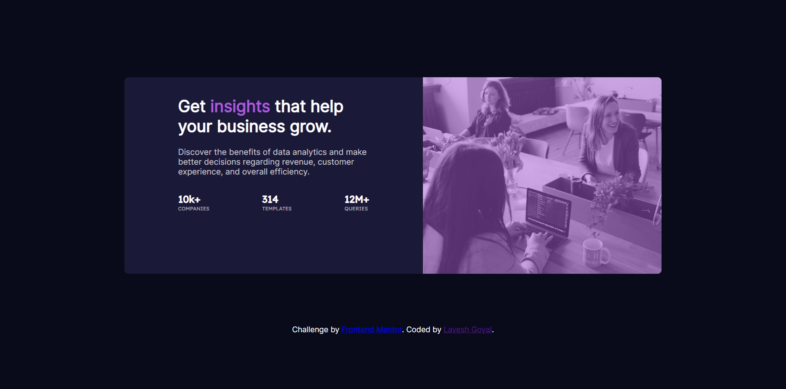

# Frontend Mentor - Stats preview card component solution

This is a solution to the [Stats preview card component challenge on Frontend Mentor](https://www.frontendmentor.io/challenges/stats-preview-card-component-8JqbgoU62). Frontend Mentor challenges help you improve your coding skills by building realistic projects.

## Table of contents

-   [Overview](#overview)
    -   [The challenge](#the-challenge)
    -   [Screenshot](#screenshot)
    -   [Links](#links)
-   [My process](#my-process)
    -   [Built with](#built-with)
    -   [What I learned](#what-i-learned)
-   [Author](#author)

## Overview

### The challenge

Users should be able to:

-   View the optimal layout depending on their device's screen size

### Screenshot



### Links

-   Solution URL: [Add solution URL here](https://your-solution-url.com)
-   Live Site URL: [Add live site URL here](https://your-live-site-url.com)

## My process

### Built with

-   Semantic HTML5 markup
-   CSS custom properties
-   Flexbox

### What I learned

I learned implementing the HTML tags and attributes on a Website. I also learned how to use Flexbox.

I didn't know this property of CSS before :

```css
*{
  box-sizing: border-box;
}
```

## Author

-   Linkedin - [Lavesh Goyal](https://www.linkedin.com/in/lavesh-goyal-146223172)
-   Frontend Mentor - [@laveshgo](https://www.frontendmentor.io/profile/laveshgo)
-   Twitter - [@lavesh_go](https://www.twitter.com/lavesh_go)
